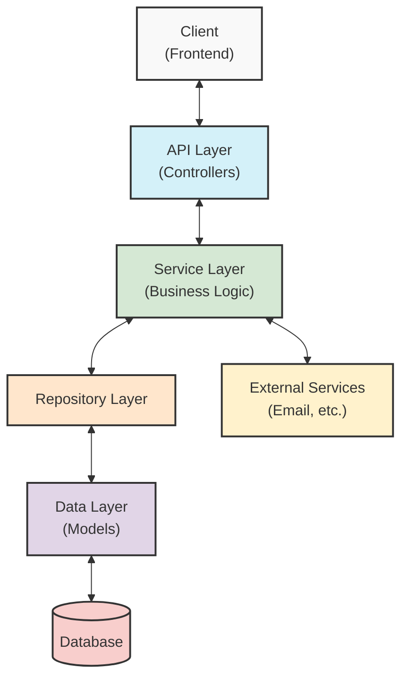
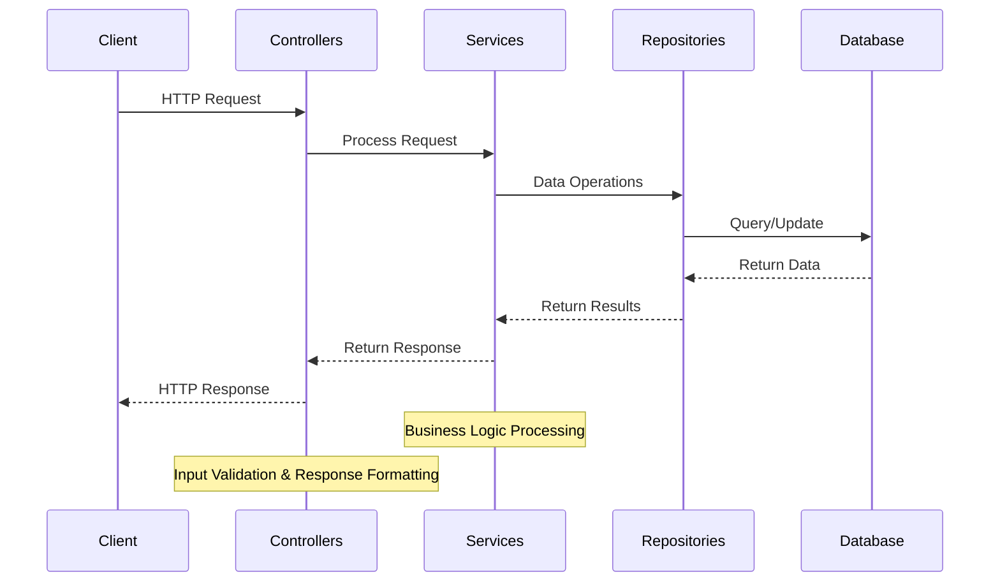
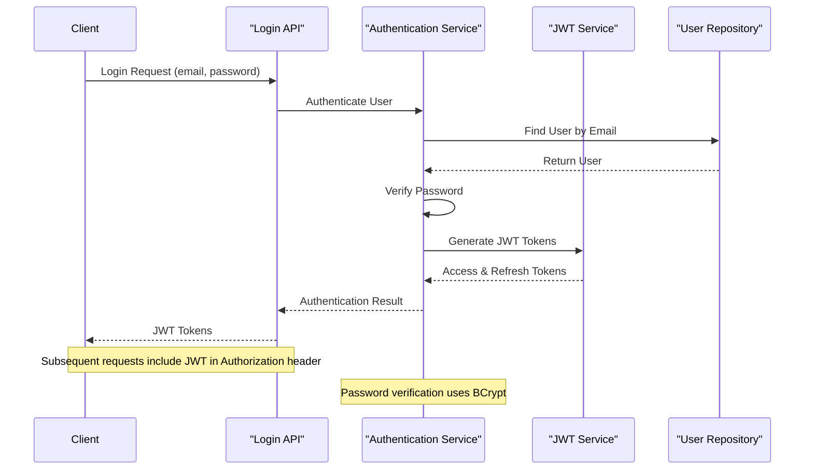
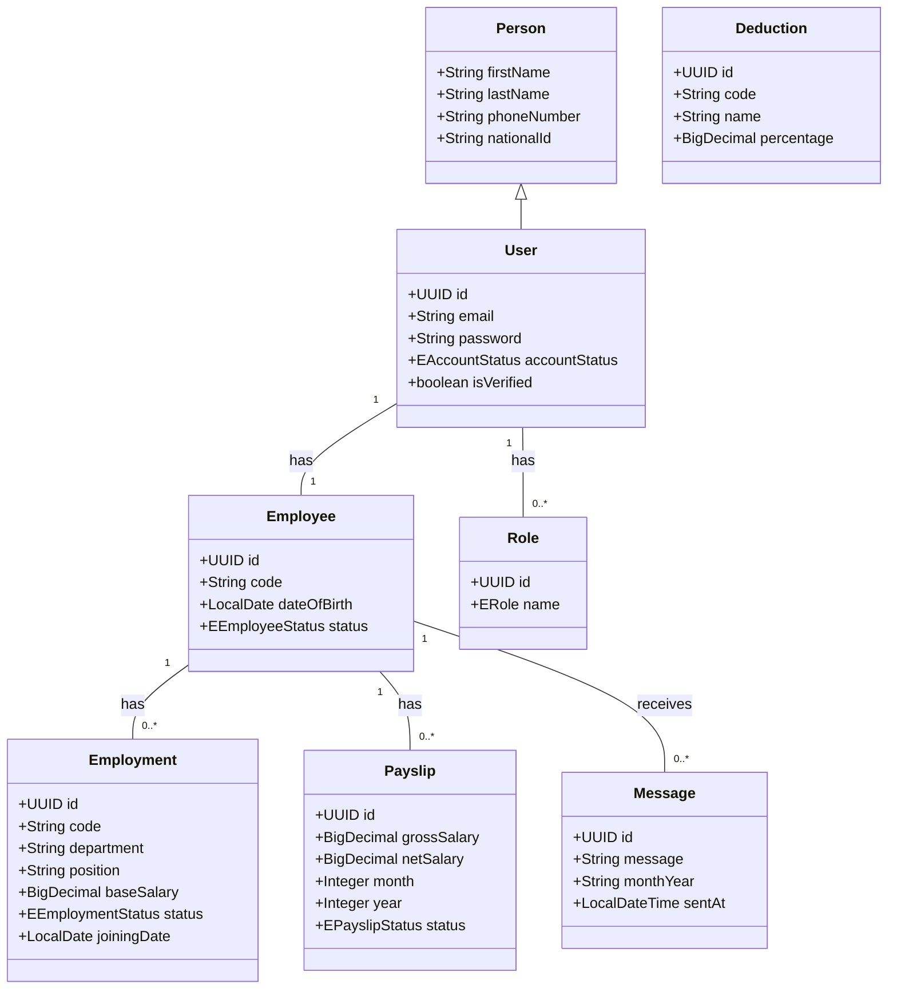

# Enterprise Resource Planning (ERP) System

A comprehensive system for managing enterprise resources including employee management, payroll processing, and internal messaging with secure authentication and role-based access control.

> **Note:** This README contains diagrams created with [Mermaid](https://mermaid-js.github.io/mermaid/), which renders automatically on platforms like GitHub. If you're viewing this on a platform that doesn't support Mermaid, you may need to use a Mermaid viewer or plugin to see the diagrams properly.

## Table of Contents

- [Overview](#overview)
- [System Architecture](#system-architecture)
- [Data Flow Diagram](#data-flow-diagram)
- [Authentication Flow](#authentication-flow)
- [User Flows by Role](#user-flows-by-role)
- [Project Structure](#project-structure)
- [API Endpoints](#api-endpoints)
- [Database Schema](#database-schema)
- [Entity Relationship Diagram (ERD)](#entity-relationship-diagram-erd)
- [Setup and Installation](#setup-and-installation)
- [Security Features](#security-features)

## Overview

The Enterprise Resource Planning (ERP) System is a Spring Boot application designed to manage various aspects of enterprise operations. It provides a secure API with JWT authentication and role-based access control to ensure that only authorized users can perform specific operations.

Key features include:
- User authentication and authorization with JWT tokens
- Employee management
- Employment records management
- Payroll processing and management
- Deduction management
- Internal messaging system
- Role-based access control (Admin, Manager, and Employee roles)
- Email notifications for account verification and password reset

## System Architecture



The ERP System follows a layered architecture:

1. **API Layer (Controllers)**: Handles HTTP requests and responses, input validation, and routing.
2. **Service Layer**: Contains business logic, transaction management, and integration with external services.
3. **Repository Layer**: Provides data access and persistence operations.
4. **Data Layer (Models)**: Defines the domain entities and their relationships.
5. **Security Layer**: Manages authentication, authorization, and secure communication.

## Data Flow Diagram



## Authentication Flow



The authentication process works as follows:

1. **Registration**: Users can register through the admin registration endpoint (for admin users) or be created by admins (for standard users).
2. **Email Verification**: After registration, users receive a verification code via email to verify their account.
3. **Login**: Users provide their email and password to the login endpoint.
4. **Token Generation**: Upon successful authentication, the system generates JWT access and refresh tokens.
5. **Authorization**: For subsequent requests, clients include the JWT token in the Authorization header.
6. **Token Validation**: The JwtAuthFilter intercepts requests, validates the token, and sets up the security context.
7. **Access Control**: Endpoints are secured with role-based access control using Spring Security's @PreAuthorize annotations.
8. **Token Refresh**: When the access token expires, clients can use the refresh token to obtain a new access token.
9. **Password Management**: Users can reset their password via email verification or update it when logged in.

## Project Structure

The project follows a standard Spring Boot application structure:

```
src/
├── main/
│   ├── java/
│   │   └── com/
│   │       └── erp/
│   │           ├── annotations/
│   │           ├── common/
│   │           ├── config/
│   │           ├── controllers/
│   │           ├── dtos/
│   │           │   ├── request/
│   │           │   └── response/
│   │           ├── enums/
│   │           ├── exceptions/
│   │           ├── handler/
│   │           ├── mapper/
│   │           ├── models/
│   │           ├── payload/
│   │           ├── repositories/
│   │           ├── security/
│   │           │   ├── jwt/
│   │           │   └── user/
│   │           ├── services/
│   │           │   └── impl/
│   │           ├── standalone/
│   │           ├── utils/
│   │           │   └── helpers/
│   │           └── EnterpriseResourcePlanningApplication.java
│   └── resources/
│       ├── application.yml
│       └── templates/
└── test/
    └── java/
        └── com/
            └── erp/
```

### Key Components:

- **annotations**: Custom validation annotations
- **config**: Application configuration classes (Security, OpenAPI, etc.)
- **controllers**: REST API endpoints
- **dtos**: Data Transfer Objects for request and response
- **enums**: Enumeration types
- **exceptions**: Custom exception classes
- **handler**: Global exception handlers
- **mapper**: Object mapping utilities
- **models**: Domain entities (Employee, Employment, Payslip, etc.)
- **payload**: Common response structures
- **repositories**: Data access interfaces
- **security**: Authentication and authorization components
- **services**: Business logic implementation
- **standalone**: Standalone services (e.g., EmailService)
- **utils**: Utility classes and helpers

## API Endpoints

The ERP System provides the following API endpoints:

### Authentication

- `POST /api/v1/auth/login`: Authenticate user and get JWT tokens
- `POST /api/v1/auth/admin/register`: Register a new admin user
- `POST /api/v1/auth/forgot-password`: Initiate password reset process
- `POST /api/v1/auth/reset-password`: Reset password with verification code
- `POST /api/v1/auth/initiate-verification`: Initiate account verification
- `POST /api/v1/auth/verify-account`: Verify account with verification code
- `POST /api/v1/auth/resend-verification`: Resend verification code
- `POST /api/v1/auth/update-password`: Update password for authenticated user
- `POST /api/v1/auth/logout`: Logout and invalidate tokens

### Users

- `GET /api/v1/users`: Get all users (Admin only)
- `GET /api/v1/users/{id}`: Get user by ID
- `PUT /api/v1/users/{id}`: Update user
- `DELETE /api/v1/users/{id}`: Delete user (Admin only)

### Employees

- `POST /api/v1/employees`: Create a new employee (Admin/Manager only)
- `GET /api/v1/employees/{id}`: Get employee by ID
- `PUT /api/v1/employees/{id}`: Update employee
- `GET /api/v1/employees`: Get all employees (paginated)
- `DELETE /api/v1/employees/{id}`: Delete employee (Admin only)

### Employment

- `POST /api/v1/employments`: Create a new employment record
- `GET /api/v1/employments/{id}`: Get employment record by ID
- `PUT /api/v1/employments/{id}`: Update employment record
- `GET /api/v1/employments`: Get all employment records
- `GET /api/v1/employments/employee/{employeeId}`: Get employment records by employee ID
- `DELETE /api/v1/employments/{id}`: Delete employment record

### Payroll

- `POST /api/v1/payroll/generate/{employeeId}/{month}/{year}`: Generate payslip for an employee
- `POST /api/v1/payroll/generate/month/{month}/{year}`: Generate payroll for a month
- `PUT /api/v1/payroll/approve/{payslipId}`: Approve a payslip
- `PUT /api/v1/payroll/approve/month/{month}/{year}`: Approve payroll for a month
- `GET /api/v1/payroll/{id}`: Get payslip by ID
- `GET /api/v1/payroll/employee/{employeeId}`: Get payslips by employee ID
- `GET /api/v1/payroll/status/{status}`: Get payslips by status
- `GET /api/v1/payroll/month/{month}/{year}`: Get payslips by month and year
- `GET /api/v1/payroll/current`: Get payslips for current employee

### Deductions

- `POST /api/v1/deductions`: Create a new deduction
- `GET /api/v1/deductions/{id}`: Get deduction by ID
- `PUT /api/v1/deductions/{id}`: Update deduction
- `GET /api/v1/deductions`: Get all deductions
- `DELETE /api/v1/deductions/{id}`: Delete deduction

### Messages

- `POST /api/v1/messages`: Create a new message
- `GET /api/v1/messages/{id}`: Get message by ID
- `GET /api/v1/messages`: Get all messages
- `GET /api/v1/messages/employee/{employeeId}`: Get messages by employee ID

## Database Schema

```mermaid
erDiagram
    PERSON {
        string firstName
        string lastName
        string phoneNumber
        string nationalId
    }

    USER {
        uuid id PK
        string email UK
        string password
        enum accountStatus
        boolean isVerified
        string verificationCode
        datetime verificationCodeGeneratedAt
        string passwordResetCode
        datetime passwordResetCodeGeneratedAt
    }

    ROLE {
        uuid id PK
        enum name
    }

    EMPLOYEE {
        uuid id PK
        string code UK
        uuid user_id FK
        date dateOfBirth
        enum status
    }

    EMPLOYMENT {
        uuid id PK
        string code UK
        uuid employee_id FK
        string department
        string position
        decimal baseSalary
        enum status
        date joiningDate
    }

    DEDUCTION {
        uuid id PK
        string code UK
        string name UK
        decimal percentage
    }

    PAYSLIP {
        uuid id PK
        uuid employee_id FK
        decimal housingAmount
        decimal transportAmount
        decimal employeeTaxAmount
        decimal pensionAmount
        decimal medicalInsuranceAmount
        decimal otherDeductions
        decimal grossSalary
        decimal netSalary
        int month
        int year
        enum status
    }

    MESSAGE {
        uuid id PK
        uuid employee_id FK
        text message
        string monthYear
        datetime sentAt
    }

    USER --|> PERSON : extends
    USER }|--|| EMPLOYEE : has
    USER }o--o{ ROLE : has
    EMPLOYEE ||--o{ EMPLOYMENT : has
    EMPLOYEE ||--o{ PAYSLIP : has
    EMPLOYEE ||--o{ MESSAGE : receives
end
```

The ERP System uses a PostgreSQL database with the following main entities:

- **users**: Stores user authentication and profile information
- **roles**: Defines user roles (ADMIN, MANAGER, EMPLOYEE)
- **user_roles**: Many-to-many relationship between users and roles
- **employees**: Stores employee information
- **employments**: Stores employment details (position, department, salary)
- **deductions**: Stores deduction types and percentages
- **payslips**: Stores payslip information with salary components and deductions
- **messages**: Stores internal messages

## Entity Relationship Diagram (ERD)

The following diagram illustrates the relationships between the main entities in the ERP system:



This class diagram shows the inheritance and associations between entities in the system. The arrows indicate the direction of the relationship, and the numbers indicate the cardinality (e.g., "1" to "0..*" means one-to-many relationship).

## Setup and Installation

### Prerequisites

- Java 17 or higher
- Maven
- PostgreSQL

### Configuration

1. Clone the repository
2. Configure the database connection in `application.yml`:
   ```yaml
   spring:
     datasource:
       url: jdbc:postgresql://localhost:5432/erp
       username: your_username
       password: your_password
   ```
3. Configure email settings for account verification and password reset:
   ```yaml
   spring:
     mail:
       host: smtp.example.com
       port: 587
       username: your_email
       password: your_password
   ```
4. Configure JWT settings:
   ```yaml
   application:
     security:
       jwt:
         secret-key: your_secret_key
         expiration: 86400000  # 24 hours
         refresh-token:
           expiration: 604800000  # 7 days
   ```

### Building and Running

1. Build the project:
   ```
   mvn clean install
   ```
2. Run the application:
   ```
   mvn spring-boot:run
   ```
3. Access the API at `http://localhost:8000/api/v1`
4. Access the Swagger UI at `http://localhost:8000/api/v1/swagger-ui.html`

## Security Features

The ERP System implements several security features:

1. **JWT Authentication**: Secure token-based authentication
2. **Password Encryption**: Passwords are securely hashed using BCrypt
3. **Role-Based Access Control**: Different permissions for admin, manager, and employee users
4. **Email Verification**: Account verification via email
5. **Password Reset**: Secure password reset via email verification
6. **CORS Configuration**: Controlled cross-origin resource sharing
7. **Input Validation**: Request validation using Jakarta Bean Validation
8. **Exception Handling**: Comprehensive error handling and reporting
9. **Audit Logging**: Tracking of entity creation and modification
